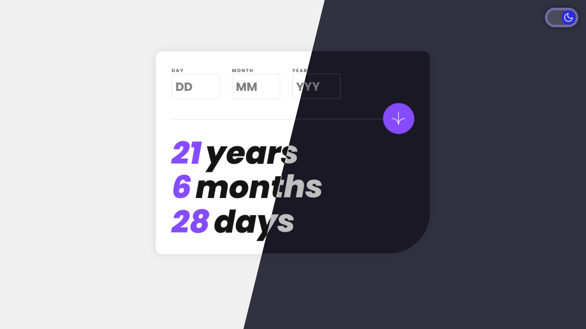

<h1 align="center">Age Calculator App</h1>

<div align="center">
  <h3>
    <a href="https://age-calculator-alamin.netlify.app/">
      🚀 Live Site
    </a>
    |
    <a href="https://www.frontendmentor.io/solutions/age-calculator-app-w-dark-mode-06OUOxbx0Q">
      💡 Solution
    </a>
  </h5>
</div>

<p align="center">
  
</p>

<a align="center" href="https://age-calculator-alamin.netlify.app/">


</a>

## The challenge

Users should be able to:

- View an age in years, months, and days after submitting a valid date through the form
- Receive validation errors if:
  - Any field is empty when the form is submitted
  - The day number is not between 1-31
  - The month number is not between 1-12
  - The year is in the future
  - The date is invalid e.g. 31/04/1991 (there are 30 days in April)
  - **Bonus**: The birthdate is earlier than today.
- View the optimal layout for the interface depending on their device's screen size
- See hover and focus states for all interactive elements on the page
- **Bonus**: See the age numbers animate to their final number when the form is submitted
- **Bonus:** Dark mode toggle

## Built with

- Semantic HTML5 markup
- CSS custom properties
- JavaScript
- Mobile-first workflow
- NPM
- [Webpack](https://webpack.js.org/)

## What I learned

During the development of this project, I had the opportunity to learn a lot about planning and organization. I realized that without a clear plan, it can be easy to lose track of the big picture and get bogged down in the details. By breaking the project down into smaller, more manageable tasks, I was able to focus on one thing at a time and make steady progress towards the end goal.

In addition to planning, I also learned the importance of writing clean, efficient code. At first, I was focused on getting the code to work, but as I went along, I began to see the value in writing code that is easy to read and understand. Adding comments to explain what each function and block of code does is especially helpful, not just for myself, but for anyone who may work with the code in the future.

Finally, working on this project helped me to develop my problem-solving skills. There were several instances where I encountered roadblocks and had to come up with better solutions to overcome them. This required me to think outside the box and consider new approaches to solving problems. By pushing myself to think differently, I was able to develop a more versatile problem-solving skillset that I can apply to future projects. Overall, this project was a valuable learning experience that taught me important skills.

## Installation

- Clone this repo:

```sh
git clone https://github.com/CodePapa360/Age-Calculator-app.git
```

- Install dependencies:

```sh
npm install
```

- Build command:

```sh
npm run build
```

- Live server:

```sh
npm start
```

## Author

<b>👤 Alamin</b>

- Twitter - [@CodePapa360](https://www.twitter.com/CodePapa360)
- LinkedIn - [@CodePapa360](https://www.linkedin.com/in/codepapa360)
- Frontend Mentor - [@CodePapa360](https://www.frontendmentor.io/profile/CodePapa360)
- Github: [@CodePapa360](https://github.com/codepapa360)

Feel free to contact me with any questions or feedback!

## Show your support

Give a ⭐️ if you liked this project!

## Acknowledgments

Special thanks to Frontend Mentor for providing such an amazing platform to practice and improve my frontend skills. The challenges and projects available on the website were both fun and challenging, and helped me learn a lot in a short amount of time.

## License

This project is licensed under the [MIT](https://github.com/CodePapa360/Age-Calculator-app/blob/main/LICENSE.md) license, which means you can use, modify, and distribute the code as you wish. If you have any questions or feedback, feel free to reach out. Thank you for considering my code!
